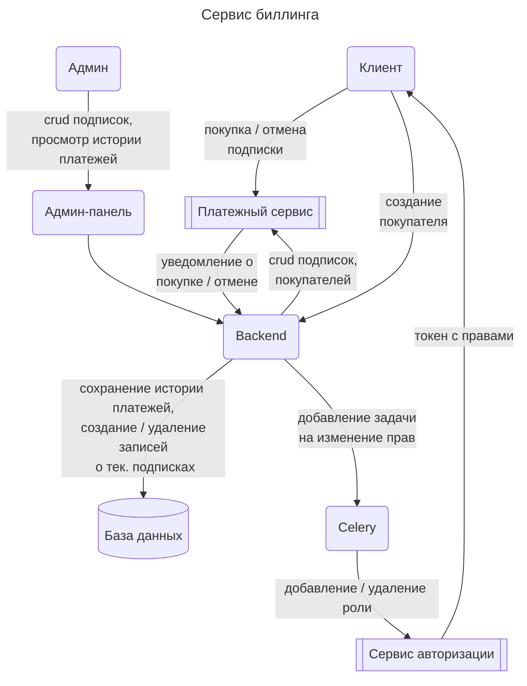

```mermaid

---
title: Сервис биллинга
---
flowchart
    client(Клиент)
    admin(Админ)
    ps[[Платежный сервис]]
    auth[[Сервис авторизации]]
    backend(Backend)
    ap(Админ-панель)
    celery(Celery)
    db[(База данных)]

    client -->|покупка / отмена\n подписки| ps
    client -->|создание\n покупателя| backend
    admin -->|crud подписок,\nпросмотр истории платежей| ap
    ap --> backend
    ps -->|уведомление о\n покупке / отмене| backend
    backend -->|crud подписок,\nпокупателей| ps
    backend -->|сохранение истории платежей,\n создание / удаление записей\n о тек. подписках| db
    backend -->|добавление задачи\nна изменение прав| celery
    celery -->|добавление / удаление роли| auth
    auth -->|токен с правами| client
```