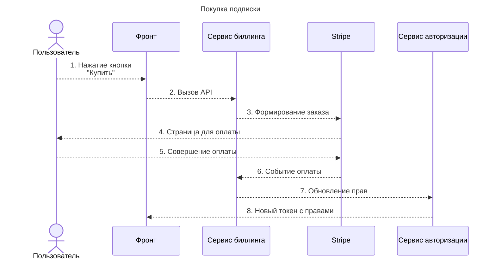
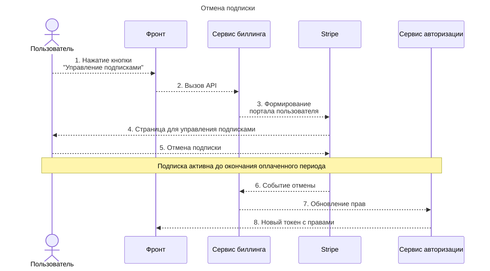

```mermaid
---
title: Покупка подписки
---
sequenceDiagram
    actor Client as Пользователь
    participant UI as Фронт
    participant Billing as Сервис биллинга
    participant Stripe
    participant Auth as Сервис авторизации

    Client -->> UI: 1. Нажатие кнопки<br/>"Купить"
    UI -->> Billing: 2. Вызов API
    Billing -->> Stripe: 3. Формирование заказа
    Stripe -->> Client: 4. Страница для оплаты
    Client -->> Stripe: 5. Совершение оплаты
    Stripe -->> Billing: 6. Событие оплаты
    Billing -->> Auth: 7. Обновление прав
    Auth -->> UI: 8. Новый токен с правами
```

```mermaid
---
title: Отмена подписки
---
sequenceDiagram
    actor Client as Пользователь
    participant UI as Фронт
    participant Billing as Сервис биллинга
    participant Stripe
    participant Auth as Сервис авторизации

    Client -->> UI: 1. Нажатие кнопки<br/>"Управление подписками"
    UI -->> Billing: 2. Вызов API
    Billing -->> Stripe: 3. Формирование<br/>портала пользователя
    Stripe -->> Client: 4. Страница для управления подписками
    Client -->> Stripe: 5. Отмена подписки
    Note over Client, Auth: Подписка активна до окончания оплаченного периода
    Stripe -->> Billing: 6. Событие отмены
    Billing -->> Auth: 7. Обновление прав
    Auth -->> UI: 8. Новый токен с правами
```
