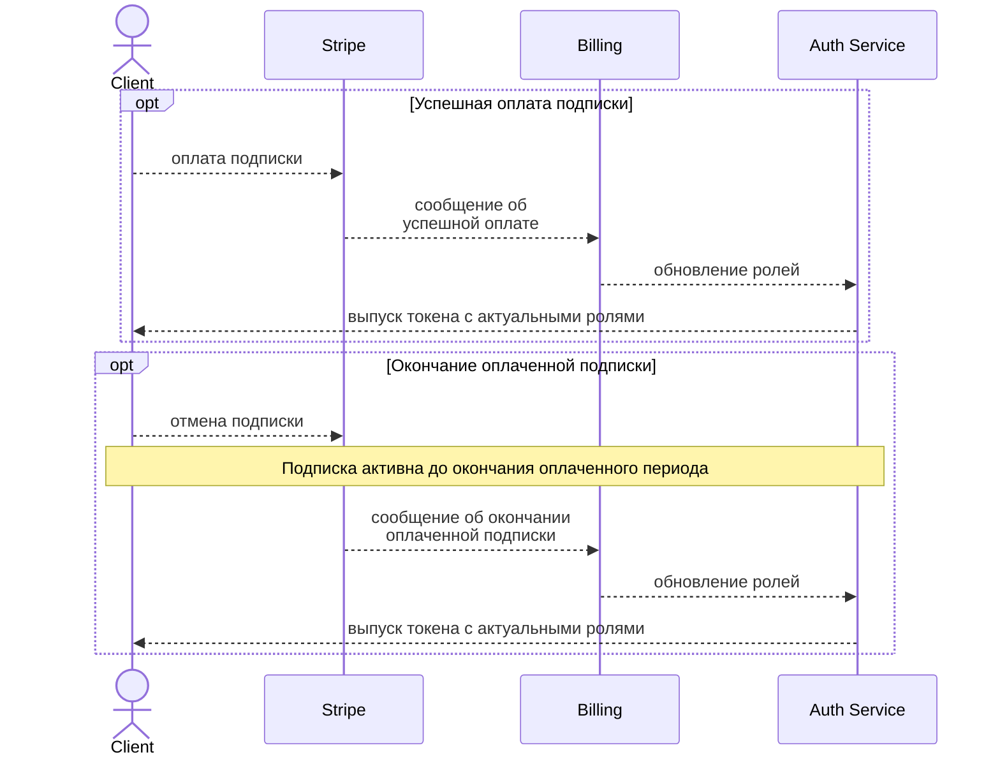

```mermaid
sequenceDiagram
    actor Client
    opt Успешная оплата подписки
        Client -->> Stripe: оплата подписки
        Stripe -->> Billing: сообщение об<br/>успешной оплате
        Billing -->> Auth Service: обновление ролей
        Auth Service -->> Client: выпуск токена с актуальными ролями
    end
    opt Окончание оплаченной подписки
        Client -->> Stripe: отмена подписки
        Note over Client,Auth Service: Подписка активна до окончания оплаченного периода
        Stripe -->> Billing: сообщение об окончании<br/>оплаченной подписки
        Billing -->> Auth Service: обновление ролей
        Auth Service -->> Client: выпуск токена с актуальными ролями
    end
```
